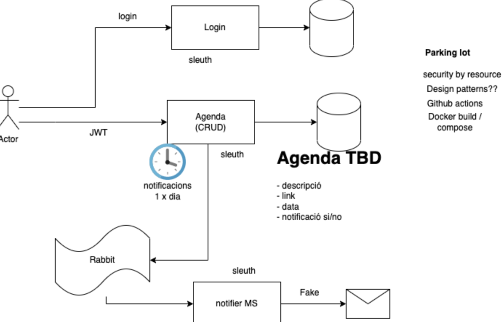

# appointment-scheduler-be

This project for training aims to follow this structure:

The login part is done in security module and the agenda in scheduler module

**RabbitMQ**

RabbitMQ is open-source message-broker software that originally implemented the Advanced Message Queuing Protocol. RabbitMQ is a queue management tool that works on the principle of “FIFO” (First in First out). Rabbit processes all the incoming messages from itself before forwarding it to server or application. In case, application/server is down, Rabbit will store the incoming messages in it unless the application/server is back up and running.

**AMQP**

AMQP (Advanced Message Queuing Protocol) is a messaging protocol that enables conforming client applications to communicate with conforming messaging middleware brokers.

Messaging brokers receive messages from publishers (applications that publish them, also known as producers) and route them to consumers (applications that process them).

Since it is a network protocol, the publishers, consumers and the broker can all reside on different machines.

In this schema we can see that messages are published to exchanges, which are often compared to post offices or mailboxes. Exchanges then distribute message copies to queues using rules called bindings. Then the broker either deliver messages to consumers subscribed to queues, or consumers fetch/pull messages from queues on demand.

**Types of exchanges**

Exchanges take a message and route it into zero or more queues. The routing algorithm used depends on the exchange type and rules called bindings. 

Besides the exchange type, exchanges are declared with a number of attributes, the most important of which are:

- Name
- Durability (exchanges survive broker restart)
- Auto-delete (exchange is deleted when last queue is unbound from it)
- Arguments (optional, used by plugins and broker-specific features)